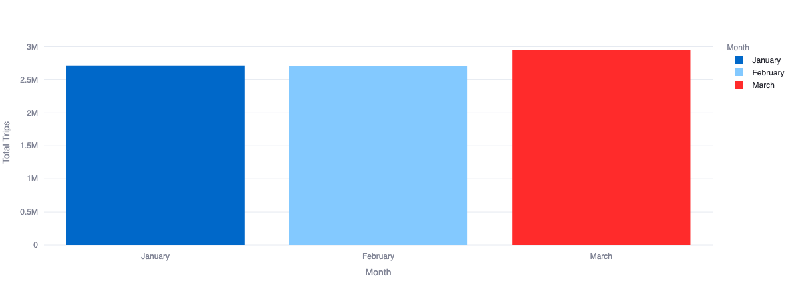
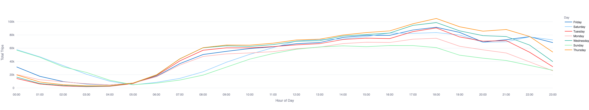
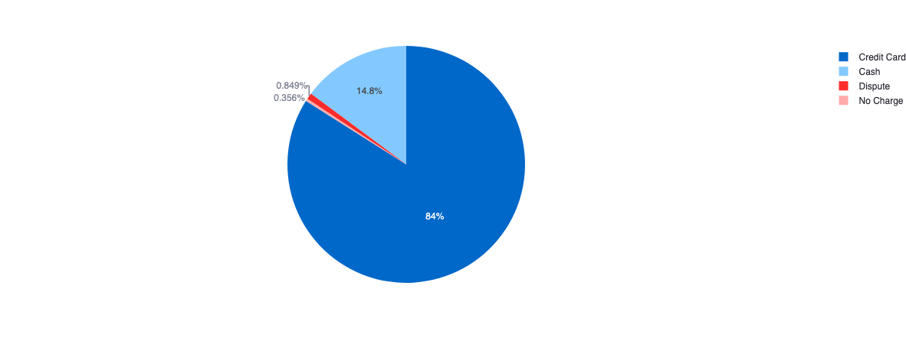
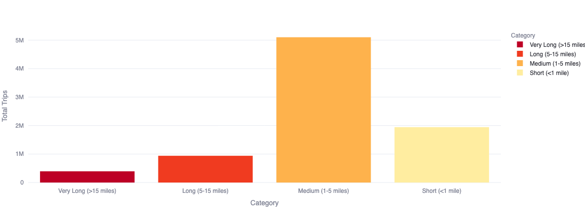
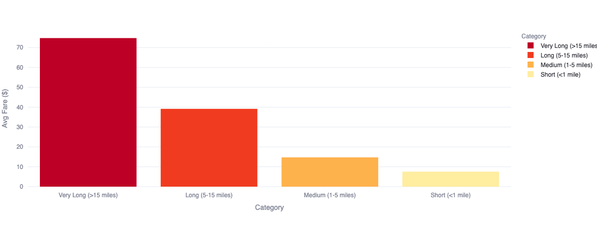

# NYC Taxi Analytics
An end-to-end data engineering project analyzing ~10 million NYC yellow taxi using dbt and DuckDB.

## Project Overview
This project builds an analytic pipeline on NYC TLC yellow taxi trip data from January-March 2024, demonstrating data engineering skills including data modeling, incremental loading, data quality testing, and visualization.

## Live Dashboard
[View on Streamlit](https://erng-16-nyc-taxi-dbt-dashboard-00001.streamlit.app/)

## Tech Stack
| Tool | Purpose |
|---|---|
| **dbt** | Data transformation and modeling |
| **DuckDB** | Local Data Warehouse |
| **Python** | Data loading |
| **SQL** | Data transformation and analysis|
| **Streamlit** | Dashboard and visualization |
| **Plotly** | Interactive charts |

## Project Structure

```
nyc_taxi_analytics/
├── models/
│   ├── staging/
│   │   └── stage_yellow_taxi_details.sql  # cleaning, filtering
│   └── marts/
│       ├── fact_trips.sql                 # core fact table (incremental), trip_id generation + record deduplication
│       ├── hourly_demand.sql              # trips by hour and day of week
│       ├── monthly_trends.sql             # monthly aggregations
│       ├── trip_category_summary.sql      # analysis by trip distance category
│       └── schema.yml                     # tests and documentation
├── macros/
│   └── trip_category.sql                  # custom trip distance macro
├── packages.yml                           # dbt_utils dependency
└── dbt_project.yml                        # project configuration
```
## Data Quality Issues Found & Fixes
- **Timestamp anomolies:** raw data contained 19 records with years ranging from 2002 to 2023, possibly due to taxi meter malfunctions or clock resets when meters are replaced. Additionally, 2 records appeared with an April 2024 timestamp, likely due to trips occurring near midnight on March 31st being recorded in UTC rather than Eastern Time. Since further confirmation is not possible without additional context from the source system, all out-of-range records were filtered in the staging layer using `tpep_pickup_datetime >= '2024-01-01' and tpep_pickup_datetime < '2024-04-01'`. Combined, these 21 records represent only 0.0002% of the total 9.5M trips, making the impact on overall analysis negligible.
- **Invalid trips:** approximately 11.5% of records (1.09M trips) were removed in the staging layer due to failing one or more validity checks: zero fares, zero distance, zero passengers, or trip durations outside 1–180 minutes. These are likely cancelled trips, meter errors, or test records that would distort aggregate metrics if kept.
- **Duplicate records:** because the dataset does not include a unique trip identifier (TLC removed taxi and driver IDs for privacy), surrogate keys were generated using `dbt_utils.generate_surrogate_key()` across multiple trip columns including pickup/dropoff time, location, fare, distance, and total amount. After deduplication in `fact_trips`, only 1 record was removed out of 8.4M trips. However, it is not possible to confirm whether this was a true duplicate or a legitimate trip from a different taxi that happened to share identical values across all key columns. While deduplication may occasionally remove a legitimate trip, with only 1 record affected out of 8.4M trips, the practical impact on any analysis is effectively zero.

## Key Findings
### Monthly Trip Volume

- **March had the highest trip volume** (~3M trips) while January and February were roughly equal (~2.7M each)
### Trip Volume by Hour

- **Thursday evenings peak at ~100k trips** — the busiest time of the week citywide
- **5am is the quietest hour** across all days of the week
- **Friday and Saturday nights stay busy past midnight** while Sunday drops off sharply after 9pm
### Payment Methods

- **84% of payments are made by credit card** — cash accounts for only 14.8%
### Trip Categories Volume

- **Medium trips (1–5 miles) dominate** with over 5M trips — the most common trip type
### Fare by Trip Categories

- **Very long trips (>15 miles) have the highest avg fare at ~$74** vs ~$7 for short trips under 1 mile


## dbt Features Demonstrated
- Source → Staging → Marts layered architecture
- Incremental models (`fact_trips`)
- Surrogate keys with `dbt_utils.generate_surrogate_key()`
- Custom macros (`trip_category`)
- Generic tests (`not_null`, `unique`, `accepted_values`)
- Full column-level documentation

## How to Run Locally
1. Clone the repo
2. Install dependencies
```bash
pip install duckdb dbt-duckdb streamlit plotly
```
3. Load raw data
```bash
python3 load_data.py
```
4. Run dbt
```bash
cd nyc_taxi_analytics
dbt deps
dbt run
dbt test
```
5. Run dashboard
```bash
cd ..
streamlit run dashboard.py
```
